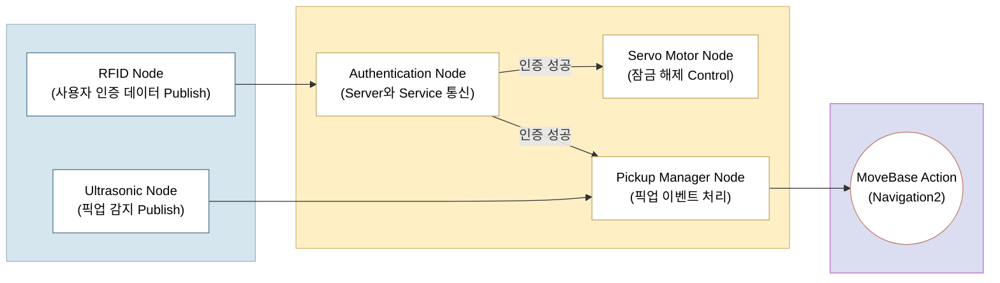

## ROS2 기반 로봇 기능 제어 구조

```mermaid
flowchart LR

%% ===== Sensors =====
subgraph S[ ]
    RFID["RFID Node<br/>(사용자 인증 데이터 Publish)"]
    US["Ultrasonic Node<br/>(픽업 감지 Publish)"]
end

%% ===== ROS2 Core =====
subgraph R[ ]
    Auth["Authentication Node<br/>(Server와 Service 통신)"]
    Servo["Servo Motor Node<br/>(잠금 해제 Control)"]
    Pickup["Pickup Manager Node<br/>(픽업 이벤트 처리)"]
end

%% ===== Action Layer =====
subgraph A[ ]
    MoveBase(("MoveBase Action<br/>(Navigation2)"))
end

%% ===== Connections =====
RFID --> Auth
Auth -->|인증 성공| Servo
Auth -->|인증 성공| Pickup
US --> Pickup
Pickup --> MoveBase

%% ===== Styling =====
classDef sensor fill:#fff,stroke:#4a708b,stroke-width:1px,color:#000;
classDef core fill:#fff,stroke:#bfa460,stroke-width:1px,color:#000;
classDef action fill:#fff,stroke:#c07a6a,stroke-width:1px,color:#000;

%% ===== Layer Background Styling =====
style S fill:#d6e6ee,stroke:#9bb3c7,stroke-width:1px;
style R fill:#feefc5,stroke:#d1b870,stroke-width:1px;
style A fill:#dadef0,stroke:#b96bc6,stroke-width:1px;

class RFID,US sensor;
class Auth,Servo,Pickup core;
class MoveBase action;

```
