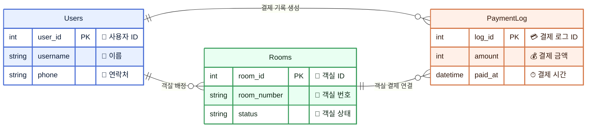

## erd 다이어그램

### mermaid 코드

```mermaid
erDiagram
    direction LR

    %% ====== Users Table ======
    Users {
        int user_id PK "👤 사용자 ID"
        string username "👤 이름"
        string phone "📱 연락처"
    }
    style Users fill:#E8F0FF,stroke:#4C70D6,stroke-width:2px,color:#0A1A35

    %% ====== Rooms Table ======
    Rooms {
        int room_id PK "🏨 객실 ID"
        string room_number "🏨 객실 번호"
        string status "🔄 객실 상태"
    }
    style Rooms fill:#E9FFF2,stroke:#3B9E5D,stroke-width:2px,color:#0E2615

    %% ====== Payment Log Table ======
    PaymentLog {
        int log_id PK "💳 결제 로그 ID"
        int amount "💰 결제 금액"
        datetime paid_at "⏱ 결제 시간"
    }
    style PaymentLog fill:#FFF0E8,stroke:#D67B4C,stroke-width:2px,color:#33180B


    %% ====== Relationships (Korean Labels) ======
    Users ||--o{ Rooms : "객실 배정"
    Users ||--o{ PaymentLog : "결제 기록 생성"
    Rooms ||--o{ PaymentLog : "객실 결제 연결"

```
